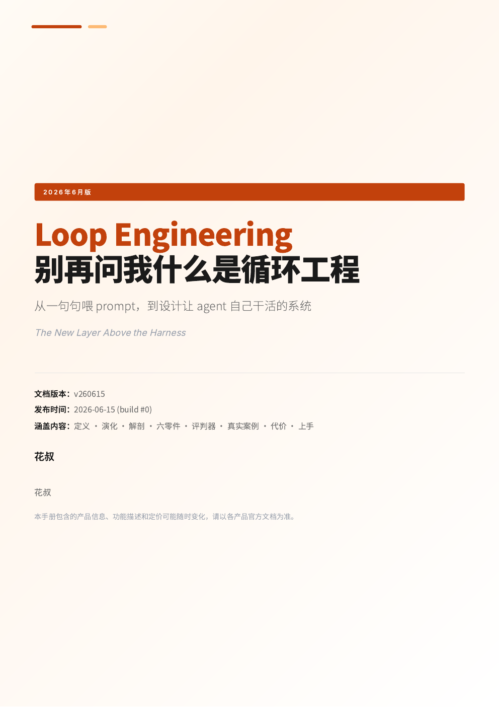
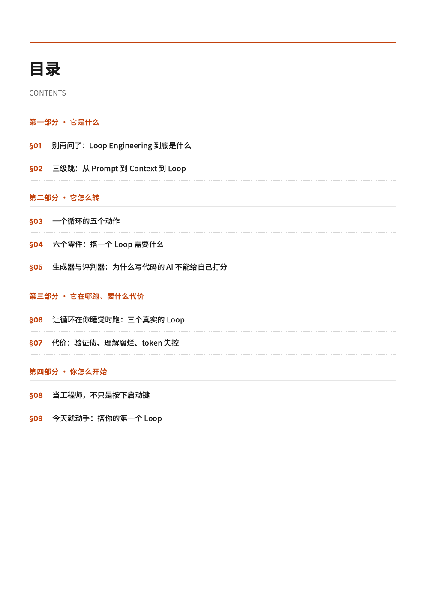
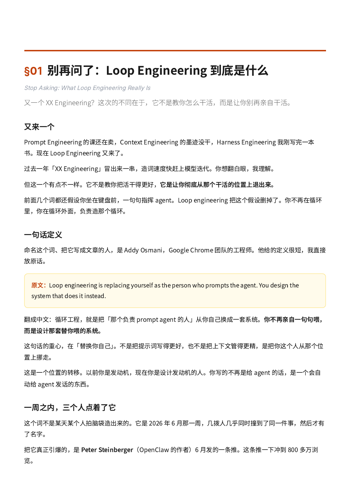
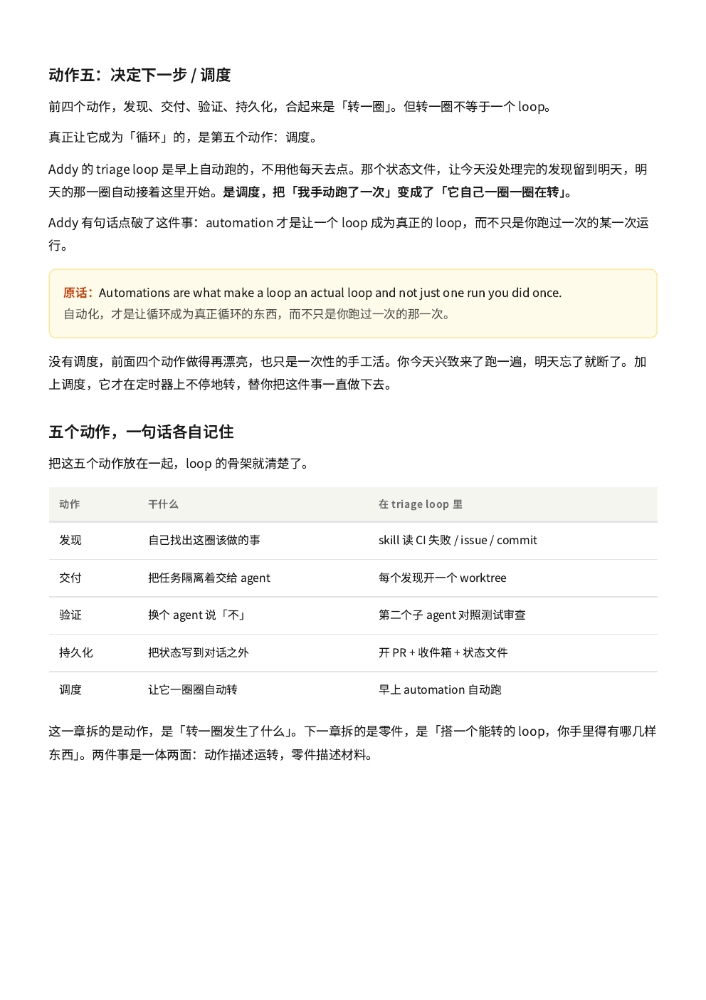

[English](README.md) | **中文版**

  

# 别再问我什么是 Loop Engineering

> 橙皮书系列 · 花叔 著

一本把 **loop engineering（循环工程）** 一次说清楚的小书。这个词在 2026 年 6 月那一周突然火起来——[Peter Steinberger](https://x.com/steipete/status/2063697162748260627)、Anthropic 管 Claude Code 的 Boris Cherny、Google 的 [Addy Osmani](https://addyosmani.com/blog/loop-engineering/) 几乎同时指向了同一件事，然后给了它名字。

一句话版本：**别再自己一句句指挥 agent 了，去设计一个替你指挥它的系统。**

  
  

## 下载

| 版本 | PDF |
|------|-----|
| 中文版 | **[PDF 下载](https://github.com/alchaincyf/loop-engineering-orange-book/raw/main/Loop-Engineering橙皮书-v260615.pdf)** |
| English | **[PDF Download](https://github.com/alchaincyf/loop-engineering-orange-book/raw/main/Loop-Engineering-The-Complete-Guide-v260615.pdf)** |

## 这本书讲什么

循环工程，**坐在 harness 的上一层楼**。harness 工程负责武装单次一个 agent——给它哪些工具、什么算干完；循环工程是它之上那层外壳：在定时器上跑、自己孵化小帮手、验证产出、记下做过什么、决定下一步。你搭一次，然后让它替你去戳 agent。

如果你读过 **《Harness Engineering》** 橙皮书，这本就是上一层楼。但它独立成书，没看过前一本也不影响。

**4 个部分，9 章：**

| 部分 | 内容 | 章节 |
|------|------|------|
| 一 · 它是什么 | 定义、一周引爆的来龙去脉、prompt → context → harness → loop 四层栈 | §01–02 |
| 二 · 它怎么转 | 一个循环的五个动作、搭它需要的六个零件、为什么写代码的 AI 不能给自己打分 | §03–05 |
| 三 · 它在哪跑、要什么代价 | 三个真实的 loop（Addy 的早间分诊、Stripe 的 Minions、调度的现实），和四笔代价——验证债、理解腐烂、token 失控、认知投降 | §06–07 |
| 四 · 你怎么开始 | 当工程师而不只是按启动键、今天就搭你的第一个 loop | §08–09 |

  
  

## 适合谁读

- 已经在用 Claude Code / Codex / Cursor、但还在一句句手动喂 agent，想往上走一层的人
- 好奇「你不该再 prompt 你的 agent」为什么一周内传疯的 AI 重度用户
- 读过《Harness Engineering》橙皮书、想要那层外循环的人

书里案例全部来自公开一手来源：Addy Osmani 的奠基文、Anthropic 的 harness 工程博客、Stripe 的 Minions，以及 Claude Code / Codex 官方文档。

## 橙皮书系列

这是橙皮书系列的一本——免费、实用的 AI 工具指南。其他书包括 Claude Code、Harness Engineering、Agent Skills、OpenClaw 等。

所有橙皮书免费下载：**[huasheng.ai/orange-books](https://www.huasheng.ai/orange-books)**

## 关于作者

**花叔** · AI Native Coder · 独立开发者

全平台 50 万+ 粉丝的 AI 内容创作者。所有产品——包括一款 AppStore 付费榜 Top 1 的 iOS app——全部用 AI 做出来，没手写过一行代码。开源了女娲.skill、huashu-design 等项目。

- X/Twitter：[@AlchainHust](https://x.com/AlchainHust)
- YouTube：[@Alchain](https://www.youtube.com/@Alchain)
- B站：[花叔v](https://space.bilibili.com/14097567/)
- 公众号：花叔
- 官网：[huasheng.ai](https://www.huasheng.ai/)

## 版本

- **v260615** — 第一版，在循环工程刚冒出来那一周写成（2026 年 6 月），基于 Addy Osmani 的奠基文和 Claude Code / Codex 官方文档。
- AI 工具迭代很快，最新信息以各产品官方文档为准。

## 许可

[MIT License](LICENSE) — 可自由使用、复制、修改、分发，包括商用。注明出处更好，但不强制。
